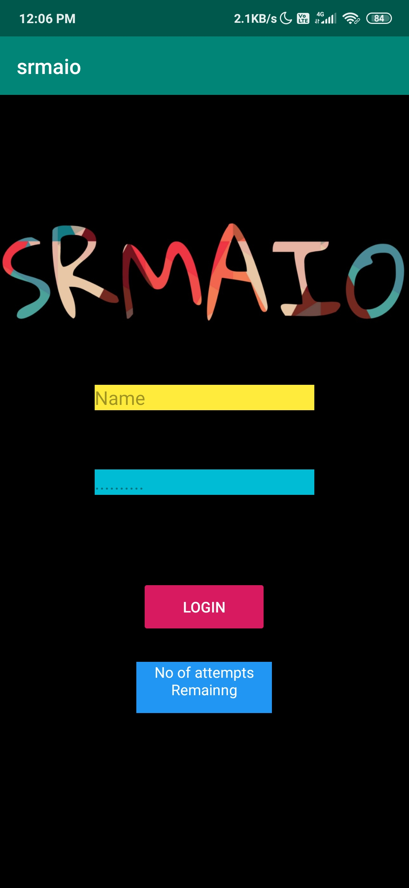
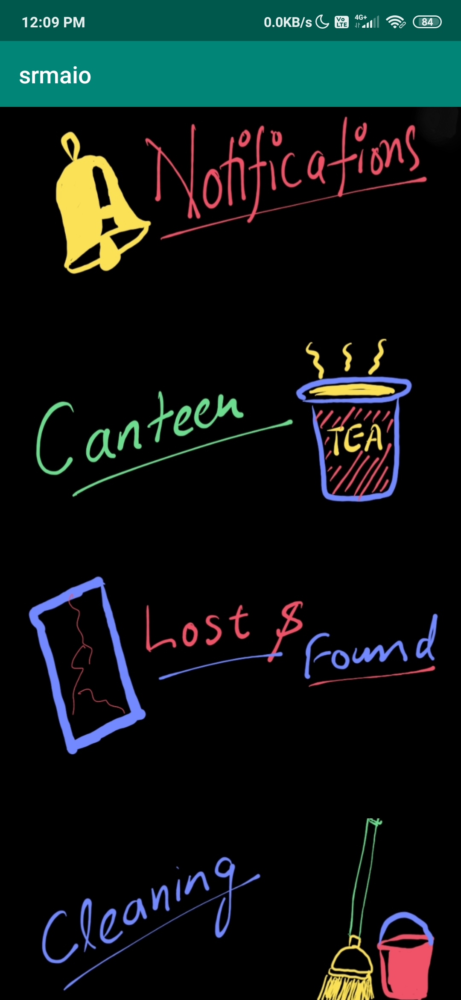
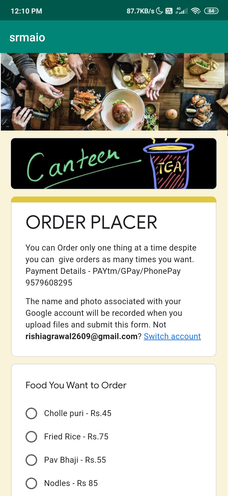
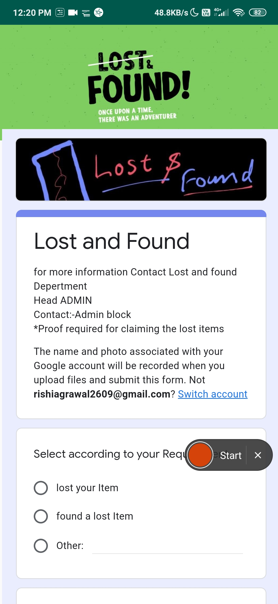
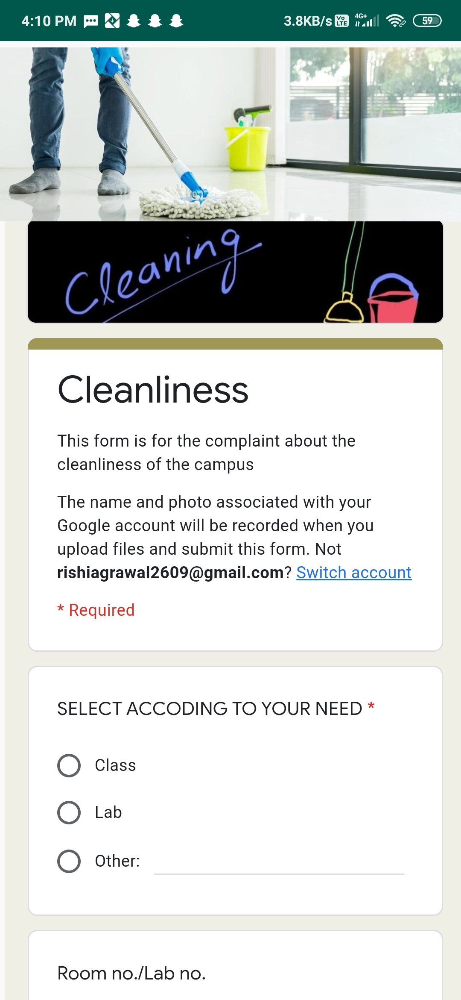

# About SRMaio
These is a all-in-one app which contains all the requirement of the collage students. We made these app as a part of 24 hour hackathon RUSH 3.0 which is conducted in our collage SRMIST,Ramapuram,Chennai. 
We won #3 prize for this app because of complete product which has everything that an app should have i.e. user interface for students and controllers and simplicity of app that can be easily edited by the controller itself no need for an app designer to redesign the app.
Here is all the documentation needed for this app. 
## Problem Statement 
This is the original problem statement given to us 
### All-in-one university support
All-in-one app where we can have complete smart services for university related to cleaniness, lost and found, canteen Orders, Event Notification, etc.  
You think standing in the queue and then ordering food and then waiting for the food to get ready is wasting of time? Yeah me too. How we could oder the food after the lectures/before reaching the canteen itself and the food get ready before you get there. 
So, you have found your earphone and not sure where you're supposed to report it? Found dirt in your classroom and don't know the appropiate authority to report it? Could we directly report this in app and the appropiate authority will take care of the situation.
## Ideation
We four sat around and came up with the Idea with proper ideation process. 
 
 
We decided to create a multiscreen android app which will have a login page and a security feature, Contents of the app, cleaniness reporting page, Canteen Ordering page, Lost and found page and event notification page.
 
Here is the details of all the pages
### Login page
 
Login page is simple just add username and password to login.
#### For this you need to put username as Admin and Password as 1234
There is also one more feature if you give the wrong password then it will show the number of tries remaining then if you  give 5 tries with wrong password you will not able to login. you have to refesrh the app to login.
### Content Page
 
This page contains all the contents present in the app and it is uniquely designed. You can tap on any field to vist the respective field.  
### Notification
  
In this all the events/workshops/updates of collage is given you can click any one to go to its discriptive details. This will be updated by the app designer. 
Walkthrough video of this page:https://youtu.be/XxqRDUqYZhI
### Canteen Orders
  
In this page you can place canteen oders and as we don't have any licenced gateway we introduced new form of payments which will come super handy. In this to make payment you have to upload a screenshot of payment done by UPI/PayTM/any other the cashier will recive your data and the screenshot. As the payment is done the cashier will also get the message.He will verify with the screenshot and if valid then your order will be placed. 
Walkthrough video of this page:https://youtu.be/incuV0iAH-c
#### Why did we use the google form instead of firebase or MySQL to fech data?
We decided have a project that should be economical and user friendly in all ways. So here we thougth of using google form because our end users did not know the android devlopment or even how to use advanced computer application(cashier or canteen vendors or admin staff). Like today some item in the listed is not avilable so to stop students form ordering that they can easily remove or change the item by themselves no extenal help required.Plus They get Google Analytics with it so that they can know what students like the most and increase their profit and reduce the waste.
### Lost and found
  
In these section you can report all the things you found any lost thing or you lost in the campus and give your proper details so that admin can easily contact you for the further details.This will be Managed by lost and found team which will comprise of staff members. 
Walkthrough video of this page:https://youtu.be/tlOVTFKjKhQ
### Cleanliness Report
  
In these page if any classroom/lab/any other area is dirty or not cleaned properly can report. For these you need to fill the form and upload the photos. We have added a feedback system so that head admin for cleanilness should know the work is done or not.
Walkthrough video of this page:https://youtu.be/r77EwW8u0TM
 
 
 
## Contact
If you have any concern or suggestion regarding this project, feel free to email me at [rishiagrawal2609@gmail.com](rishiagrawal2609@gmail.com)
